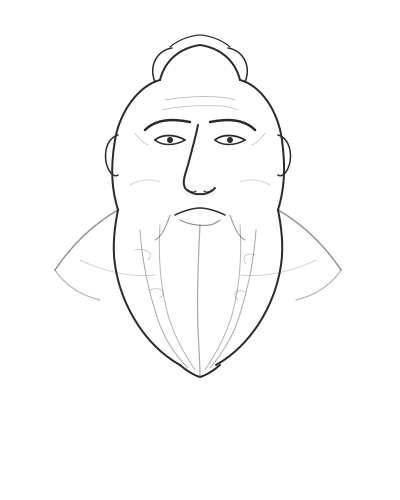

# Socrates

A Socratic method chatbot that challenges your thinking through probing questions. Built with TanStack Start, the Vercel AI SDK, and streaming LLM responses.



## Prerequisites

- **Node.js** 18+ (20+ recommended)
- **pnpm** — install with `npm install -g pnpm`
- An API key from **one** of the following providers:
  - [Anthropic](https://console.anthropic.com/) (default — uses Claude Sonnet 4.5)
  - [OpenAI](https://platform.openai.com/) (uses GPT-4o)

## Quick Start

```bash
# 1. Clone the repo
git clone https://github.com/YOUR_USERNAME/socrates.git
cd socrates

# 2. Install dependencies
pnpm install

# 3. Set up environment variables
cp .env.example .env
```

Open `.env` and fill in your keys:

```env
# Pick one provider and add its key:
ANTHROPIC_API_KEY=sk-ant-...
OPENAI_API_KEY=sk-...

# Set which provider to use ("anthropic" or "openai"):
MODEL_PROVIDER=anthropic
```

```bash
# 4. Start the dev server
pnpm dev
```

The app will be running at **http://localhost:3000**.

## Available Scripts

| Command            | Description                         |
| ------------------ | ----------------------------------- |
| `pnpm dev`         | Start dev server on port 3000       |
| `pnpm build`       | Production build                    |
| `pnpm preview`     | Preview the production build        |
| `pnpm test`        | Run tests (Vitest)                  |
| `pnpm test:watch`  | Run tests in watch mode             |
| `pnpm lint`        | Lint and check formatting (Biome)   |
| `pnpm lint:fix`    | Auto-fix lint and formatting issues |

## Project Structure

```
src/
├── routes/
│   ├── index.tsx          # Chat UI (main page)
│   ├── api/chat.ts        # POST /api/chat streaming endpoint
│   └── __root.tsx         # Root layout
├── lib/
│   ├── chat-handler.ts    # Socratic system prompt + streamText logic
│   └── model.ts           # Model provider selection (Anthropic / OpenAI)
├── components/            # Shared React components
├── styles.css             # Global styles (Tailwind CSS v4)
└── router.tsx             # TanStack Router config
```

## How It Works

1. The user types a message in the chat UI (`src/routes/index.tsx`).
2. `useChat` from `@ai-sdk/react` sends a POST request to `/api/chat`.
3. The API route (`src/routes/api/chat.ts`) calls `streamText` from the Vercel AI SDK with a Socratic method system prompt.
4. The response streams back token-by-token and renders in real time.

The system prompt instructs the model to never give direct answers — only ask probing questions that help the user examine their own thinking.

## Switching LLM Providers

Edit your `.env` file:

```env
# To use Anthropic (default):
MODEL_PROVIDER=anthropic
ANTHROPIC_API_KEY=sk-ant-your-key

# To use OpenAI:
MODEL_PROVIDER=openai
OPENAI_API_KEY=sk-your-key
```

Restart the dev server after changing environment variables.

## Deployment

The app is built on TanStack Start (Vite + Nitro), which supports multiple deployment targets. Run `pnpm build` to produce a production bundle, then deploy based on your platform:

### Vercel (recommended for simplicity)

Vercel has first-class support for Nitro-based apps.

1. Push your repo to GitHub.
2. Import the project at [vercel.com/new](https://vercel.com/new).
3. Add your environment variables (`ANTHROPIC_API_KEY` or `OPENAI_API_KEY`, `MODEL_PROVIDER`) in the Vercel dashboard under **Settings > Environment Variables**.
4. Deploy — Vercel auto-detects the framework and handles the rest.

### Netlify

1. Push your repo to GitHub.
2. Import the project at [app.netlify.com](https://app.netlify.com/).
3. Set the build command to `pnpm build` and the publish directory to `dist`.
4. Add your environment variables in **Site settings > Environment variables**.
5. Deploy.

### Railway

1. Push your repo to GitHub.
2. Create a new project at [railway.app](https://railway.app/) and connect your repo.
3. Set environment variables in the Railway dashboard.
4. Railway will detect the start command and deploy automatically.

### Fly.io

1. Install the Fly CLI: `curl -L https://fly.io/install.sh | sh`
2. Run `fly launch` from the project root and follow the prompts.
3. Set secrets:
   ```bash
   fly secrets set ANTHROPIC_API_KEY=sk-ant-your-key MODEL_PROVIDER=anthropic
   ```
4. Deploy with `fly deploy`.

### Docker (self-hosted)

```dockerfile
FROM node:20-slim AS base
RUN corepack enable && corepack prepare pnpm@latest --activate

WORKDIR /app
COPY package.json pnpm-lock.yaml pnpm-workspace.yaml ./
RUN pnpm install --frozen-lockfile

COPY . .
RUN pnpm build

EXPOSE 3000
CMD ["node", ".output/server/index.mjs"]
```

```bash
docker build -t socrates .
docker run -p 3000:3000 \
  -e MODEL_PROVIDER=anthropic \
  -e ANTHROPIC_API_KEY=sk-ant-your-key \
  socrates
```

> **Note:** The `.output` directory is the default Nitro output path. If your build output differs, check `.output/` after running `pnpm build`.

## Environment Variables Reference

| Variable            | Required | Default      | Description                          |
| ------------------- | -------- | ------------ | ------------------------------------ |
| `MODEL_PROVIDER`    | No       | `anthropic`  | `"anthropic"` or `"openai"`          |
| `ANTHROPIC_API_KEY` | Yes*     | —            | Your Anthropic API key               |
| `OPENAI_API_KEY`    | Yes*     | —            | Your OpenAI API key                  |

*Only the key for your chosen provider is required.

## Tech Stack

- **Framework:** [TanStack Start](https://tanstack.com/start) (React + Vite + Nitro)
- **AI:** [Vercel AI SDK](https://sdk.vercel.ai/) with streaming
- **Styling:** [Tailwind CSS v4](https://tailwindcss.com/)
- **Linting:** [Biome](https://biomejs.dev/)
- **Testing:** [Vitest](https://vitest.dev/) + [Testing Library](https://testing-library.com/)

## License

MIT
